# Max Moderation Bot

Модерационный бот для социальной сети Max, написанный на Go.

## Возможности

- **Двухрежимная работа**:
  - **Long Polling**: Режим по умолчанию для простой локальной разработки.
  - **Webhooks**: Автоматическое переключение при задании переменной `WEBHOOK_HOST`.
- **Модерация контента**:
  - Фильтрация по запрещенным словам и доменам.
  - Ограничение типов вложений (Изображения, Видео, Аудио, Файлы).
  - Блокировка ссылок.
  - Временный мут пользователей (`/mute` в ответ на сообщение, дефолт 30м).
  - Автоудаление сообщений бота.
  - Самоочистка временных сообщений.
- **Чистая архитектура**: Модульный дизайн с разделением бизнес-логики, обработчиков и транспорта.
- **Наблюдаемость (Observability)**:
  - Prometheus метрики на порту `9090`.
  - Отслеживание активных мутов, удаленных сообщений (с причинами) и действий бота.
  - Структурированное JSON логирование.
- **Docker Ready**: Подготовлен для запуска в контейнерах.

## Конфигурация

Скопируйте `.env.example` в `.env` и заполните ваши значения:

```bash
cp .env.example .env
```

| Переменная | Описание | По умолчанию      |
|------------|----------|-------------------|
| `BOT_TOKEN` | Ваш токен Max Bot API (Обязательно) | -                 |
| `WEBHOOK_HOST` | Публичный URL для вебхуков (напр., `https://bot.com`) | "" (Long Polling) |
| `PORT` | Порт сервера бота (для вебхуков) | `8080`            |
| `METRICS_ADDR` | Адрес для метрик Prometheus | `:9090`           |
| `LOG_LEVEL` | Уровень логирования (`debug`, `info`, `warn`, `error`) | `info`            |
| `DB_HOST` | Хост базы данных | `localhost`       |
| `DB_PORT` | Порт базы данных | `5432`            |
| `DB_USER` | Пользователь БД | `maxbot`          |
| `DB_PASSWORD` | Пароль БД | `secretpassword`  |
| `DB_NAME` | Имя базы данных | `maxbot_db`       |
| `ENABLE_CACHE` | Включить кэширование настроек | `false`           |
| `DEFAULT_MUTE_DURATION` | Длительность мута по умолчанию (если не указано в команде) | `30m`             |
| `ENABLE_TELEMETRY` | Включить отправку телеметрии | `true`            |
| `GROUP_LINKED_SUCCESS_TEXT` | Кастомный текст сообщения об успешной привязке | "" (дефолтный текст) |

## Локальный запуск

### Требования
- Go 1.25+
- Docker & Docker Compose (для базы данных)

### 1. Запуск базы данных

Для локальной разработки используйте Docker Compose для поднятия PostgreSQL:

```bash
docker-compose up -d db
```

Это запустит PostgreSQL 18 на порту 5432 с учетными данными, настроенными в `docker-compose.yml` (совпадают с `.env.example`).

### 2. Запуск бота

Установите зависимости и запустите приложение:

```bash
go mod download
go run ./cmd/bot
```

## Разработка

### Архитектура



### Структура проекта

- `cmd/bot`: Точка входа в приложение.
- `internal/app`: Инициализация приложения и связывание компонентов.
- `internal/config`: Загрузка конфигурации.
- `internal/handler`: Логика обработки обновлений бота.
- `internal/service`: Бизнес-логика (модерация, настройки, фоновые задачи очистки).
- `internal/repository`: Работа с данными (PostgreSQL).
- `internal/transport`: Транспортный слой (`webhook`, `polling`).
- `internal/metrics`: Сервер метрик и константы.
- `internal/pipeline`: Конвейер обработки сообщений (фильтры).

### Метрики

Метрики доступны по адресу `http://localhost:9090/metrics`.

Ключевые метрики:
- `maxbot_active_mutes`: Количество активных мутов.
- `maxbot_deleted_messages_total`: Количество удаленных сообщений (с разбивкой по причинам).
- `maxbot_update_processing_duration_seconds`: Время обработки обновлений.

### Линтеры

Проект требует строгого соблюдения правил (отсутствие комментариев в коде). Для проверки используйте:

```bash
make lint
# или
go vet ./...
```
